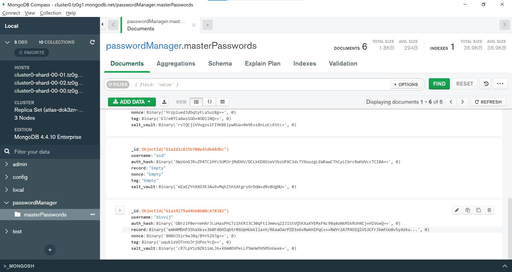

# CZ4010 Password Manager
## Chandna Divvij and Shaan Aryaman

### Motivation 

In the digital age a lot of digital infrastructure is online/ on the cloud, be it financial, medical, military information. Be it information for an individual, a company or governments. A mechanism for authentication for various services is required. Most security experts might point to biometric authentication (fingerprint, retinal scan etc.) or two factor authentication (ex. password and one time password as SMS on phone) is the recommended procedure. But this is not always possible since biometric information requires hardware to be on the users’ side in the user-client model, and two factor authentication requires infrastructure from the client side. Hence most websites/services host a simple password requirement.

The problem? Storing password is tricky and if done incorrectly can put the organisation (providing service/website) and various users of the website at risk. For example consider a website that stores all passwords for all accounts using the same encryption scheme and in a database as a list. The security issue is that many people with accounts might have used common passwords-  hence there would be many password-ciphertext values and statistical attacks can be performed based on the most common letters/words. More importantly many people use the same password across websites. So if a password is cracked on a website with substandard security practices and is also used for a bank account- then real damage can be caused to the individual. Essentially websites’ password storage security cannot be trusted and re-using the same password can lead to damage. 

Enter the password management service- a one stop service for all password needs. We have implemented an encrypted ‘vault’ containing various passwords for a user on the cloud. Essentially a user needs to remember one Master Password to access his/her vault where cryptographically strong passwords (that are tough to remember) are stored that are then used for authentication for various other services. The vault is encrypted and decrypted locally. While the vault is in the cloud and in-transit on the network it is encrypted in a secure manner.

So we have implemented a cloud based password management tool. 

### Research

While implementing our solution we realised that as we are going to store multiple encrypted vaults (each belonging to one user containing multiple passwords)- we essentially have the same problem of storing passwords- storing vaults (since there is the concept of a master password being required to access the vault)! We needed a secure way to store multiple encrypted vaults. We have essentially used two main concepts: (i) hashing with salt (ii) hashing with multiple iterations

(i) Salt is a random string of characters that is different for every single user, can be stored in plaintext, in fact can also be known by the user. While hashing a password, the salt is added to the input of the hashing algorithm as well. So if multiple users use the same master-password (that is used to authenticate their encrypted vault) completely different hashes will be generated due to the fact that random salts are different for each user. This makes it hard to perform a statistical attack on a database that has stored authentication hashes for encrypted vaults. 

(ii) A hash with many iterations can be extremely tough to brute force. A HMAC (message authentication code) is used to do multiple iterations of a given hash function. This essentially makes it difficult to reverse engineer the master-password which is used as the key. The fact that we use salt as well makes the system rather secure. 

### Design

Essentially for each user on the system we store a vault. The vault consists of a list of tuples, which contain website name, email used on the website and the corresponding password. The vault when stored on the cloud is encrypted using the AES block cipher. This vault can only be encrypted and decrypted locally. Only the master-password can authenticate a user such that the cloud sends over the encrypted vault to a local machine. At the same time only the master-password in some sense can encrypt and decrypt the vault locally. 

1. Creation of Vault Key: The master-password and username are combined. This combination and a random salt act as input to an HMAC algorithm - the PBKDF2 algorithm using the sha256 algorithm with multiple iterations (~100000) to create the vault key. This vault key is used as the key for the AES algorithm to encrypt/decrypt the vault. The salt used here is user specific. The nonce and tag (required along with key for Pycryptodome implementation of AES) values and the salt are stored in plaintext along with username, and the encrypted vault as a record in the cloud database. 

2. Creation of Authorization Hash: The Authorization Hash is generated to authenticate whether the vault belongs to a user making a request on a local machine. To generate the authorization hash we first generate the vault key. The vault key along with master-password is combined and fed as a key to the PBKDF2 algorithm using the sha256 algorithm with multiple iterations (~100000). A random salt is also fed into PBKDF2. This salt is concatenated with the authorization hash and stored along with username, encrypted vault, nonce, tag, salt of vault key as one record belonging to a user. Essentially it is stored in plaintext. 

3. Functionality: We have covered that to call vault to local machine we need to generate Authorization Hash. We then decrypt (and encrypt) the vault locally using AES with the vault key (and nonce and tag). The vault in plaintext is a list of tuples (website, email, password). We can perform many functions on this plaintext, encrypt it once we are done and send the edited vault back to the cloud. We provide the following functions: create account, add password, update password (given website and email), delete password (given website and email), extract  specific password (given website and email), view all passwords (given username). Note we ask for both website and email since one user could have multiple accounts on the same website. 

4. Add/Update Password: We have given users the option to either manually add their own passwords to the vault or use our secure random password generator. The random password generator is created using the Secrets library in Python. The user enters their requirements for the password such as the password length and number of uppercase, lowercase and special characters and a

### Development

Our password manager has been developed using the following tools and libraries:

1. Python - Python is the only programming language we have used for development, implementing the frontend, logic and backend using the language. Python has a wide variety of libraries for all purposes, such as Tkinter for the frontend, Hashlib for cryptographic hash functions, etc., making it the obvious choice for our project.

2. Cryptodome - Cryptodome is a Python library which can implement AES (Advanced Encryption Standard). AES is a symmetric block cipher and is the standard for symmetric encryption. AES is used in our project to encrypt and decrypt the vault, which is where each user’s passwords are stored. While installing- pycryptodome

3. Hashlib - Hashlib is another cryptographic Python library used for hashing algorithms. We use PBKDF2 (Password-Based Key Derivation Function 2) from Hashlib which is a key derivation function. PBKDF2 is used to generate a vault key using the user’s master  password.

4. Secrets - Secrets is a Python library used to generate cryptographically secure random numbers and strings. Secrets has been used to generate random and secure passwords for users to add to their vaults instead of entering their own passwords manually which may not be as secure.

5. MongoDB - MongoDB is a documented oriented database program, modelling the cloud database in our application. The data in our project is not stored locally but on a MongoDB database which is called by Python in our application by the PyMongo library.

6. Tkinter - Tkinter is a Python interface used to create a GUI for our project. Tkinter is Python’s standard GUI and is used to create the Desktop Application on which we run our project.

### List of files and their Functions

1. app.py - This file contains the Tkinter code for the frontend of our project.

2. hashwsalt_2.py - This file is used to get and put data into the MongoDB database. It also stores all the logic of the various functionality of our application.

3. password_maker.py - This file contains the code for the password generation function, used to generate random cryptographically secure passwords.

### To Improve

* The authorization hash is checked locally and not on server

### Installation

1. pip install pycryptodome

2. pip install pymongo

hashlib, secrets, tkinter should be installed by default along with python3

### To run

python app.py
